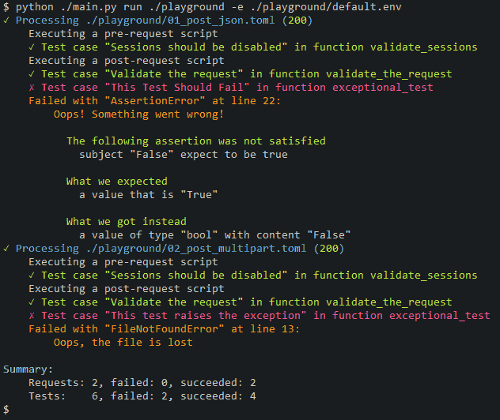

# PyApiTester
Backend API test tool

A very lightweight portable CLI alternative to electron-based monsters.

## How to use

run the main script with parameters:

```bash
./main.py run ./playground -e ./playground/default.env
```

This will

- Find all requests in "playground"
- Sort them in the alphabetic order.
- Run requests one by one, first pre-request script, then the request itself, following by post-request

See [docs][docs] or sl-alex.net/pyapitester for more information.
See [playground][playground] and take a look at test requests and environment.

This is a sample output:



## Installation

There is no need to install the tool, you can just download and use it. It has several external dependencies, listed in [requirements.txt](requirements.txt)
You can install them automatically:

```bash
pip install -r requirements.txt
```

## DISCLAIMER

As of now, this project is in the very early stage. I'm using it with Python 3.9 and it covers 99% all my needs.
Any PRs are friendly welcome, I'll be happy if you find this tool useful.

[docs]: docs
[playground]: playground