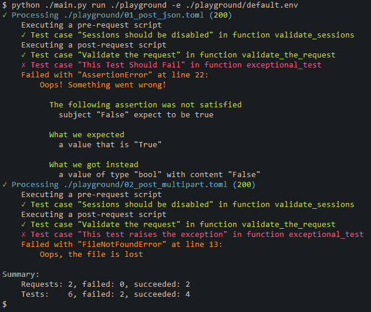

# PyApiTester Documentation

Welcome to the PyApiTester documentation! If you're new here, this guide will show you how to use PyApiTester with some handy examples.

## What is PyApiTester?

PyApiTester is a small and efficient command-line tool designed for testing backend APIs. Unlike other tools, it keeps things simple without the need for a graphical interface. All your requests are stored in a straightforward text-based format, making it easy to modify them using your favorite text editor.

## Features and Advantages

**Pros:**

- **Compact CLI Application:** PyApiTester is a concise Command-Line Interface (CLI) application written in Python.
  
- **Requests Library Integration:** Leveraging the [Requests](https://github.com/psf/requests) library, PyApiTester supports Python v3.7 and above.
  
- **Text-based Storage:** Requests and environments are stored in a version control-friendly, text-based format ([TOML](https://toml.io/){:target="_blank"}).
  
- **User-friendly Colored Output:** Enhancing readability, PyApiTester provides a visually intuitive colored output.
  
- **grappa Integration:** Seamlessly integrate with [grappa](https://github.com/grappa-py/grappa) for effortless testing.

- **Scripting Capabilities:** PyApiTester allows the inclusion of pre- and post-request scripts, enabling the incorporation of Python-based test cases.

- **Exception Handling:** Benefit from detailed exception information, facilitating smooth user script debugging.

**Cons:**

- **CLI Nature:** PyApiTester operates solely through the Command-Line Interface. For those preferring a graphical interface, consider exploring [Bruno](https://www.usebruno.com/).

- **Python v3.7+ Requirement:** Ensure Python v3.7 or a more recent version is installed.


Sometimes, a picture is worth a thousand words. Check out this sample CLI output:



Here's an example of a post-request script that tests the response:

```python
@test_case("Validate the response")
def validate_the_response():

    # You can change 'None' to any other exception type if needed, e.g., 'ConnectTimeout' or 'TooManyRedirects'
    expect(res.Exception).to.equal(None)
    expect(res.Status).to.be.equal(200)

    # You can use any environment variable. Everywhere.
    expect(res.Json["json"]["answer"]).to.be.equal(42)
    expect(res.Json["json"]["valid"]).to.be.true
    expect(res.Time).to.be.less(1000)

# You can define your functions (not test-case) and call them as usual
def test_exception():

    # This will always fail
    expect(False).to.be.true

    # This will never be executed because the line above is executed first
    expect(res.Status).to.be.equal(200)

@test_case("This Test Should Fail")
def exceptional_test():
    test_exception()
    # You can raise any exception if you want
    #raise FileNotFoundError("Oops, the file is lost")
```